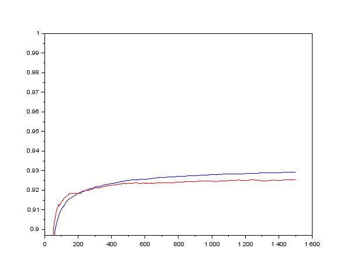
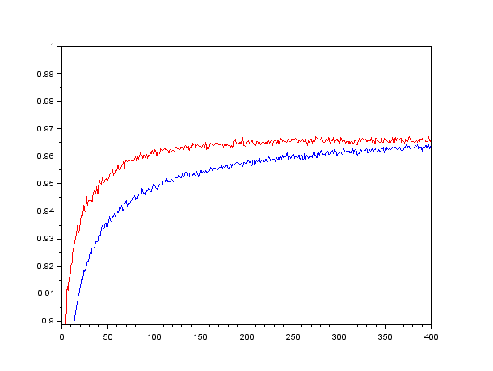
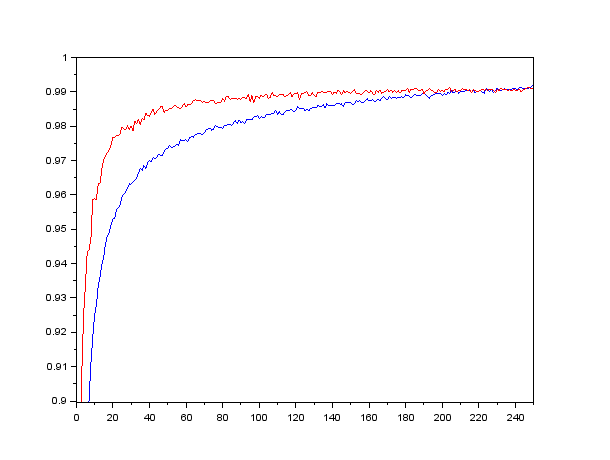
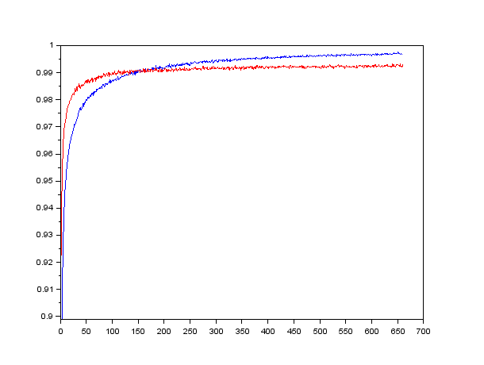

# Deeper Thought

To run training:

DeeperThought.exe configFile trainFile testFile batchSize(integer) paramFile/null saveEveryNEpochs(integer) square/log

## Input format:

expOut_1, ... , expOut_n, inp_1, ... , inp_m

For both trainFile and testFile (expOut - expected output, inp - input). One data point is one line.

You can download [MNIST dataset here](https://www.dropbox.com/s/9eoiignb7tlrr2u/mnist.zip?dl=0).

## Results for MNIST dataset:

### configA.txt (logistic regression)

#### batch size 4000, squared error

> matrix,784,10,0.5,0.0001

> sigmoid,10

Accuracy: 92.47 % (on test data)

### configC.txt (logistic regression)

#### batch size 4000, squared error, auto step size

> matrix,784,10,0.5,-0.001

> sigmoid,10

Accuracy: 92.53 % (on test data)

### configB.txt (simple 2 layered network with dropout)

#### batch size 4000, squared error

> matrix,784,100,0.5,0.001

> sigmoid,100

> dropout,100,0.25

> matrix,100,10,0.5,0.0001

> sigmoid,10

Accuracy: 96.24 % (on test data)

### configD.txt (simple 2 layered network with dropout)

#### batch size 4000, squared error, auto step size

> matrix,784,100,0.5,-0.01

> sigmoid,100

> dropout,100,0.25

> matrix,100,10,0.5,-0.01

> sigmoid,10

Accuracy: 96.33 % (on test data)

### configD.txt

#### batch size 4000, log loss error, auto step size

> matrix,784,100,0.5,-0.01

> sigmoid,100

> dropout,100,0.25

> matrix,100,10,0.5,-0.01

> sigmoid,10

Accuracy: 96.73 % (on test data)

### configE.txt (convolutional neural network CNN)

#### batch size 1000, log loss error, auto step size

> convolution,1,28,28,200,5,5,0.5,-0.001

> max,200,24,24,8,8

> matrix,1800,100,0.5,-0.001

> sigmoid,100

> dropout,100,0.25

> matrix,100,10,0.5,-0.001

> sigmoid,10

Accuracy: 99.13 % (on test data)

### configF.txt (convolutional neural network CNN)

#### batch size 1000, log loss error, auto step size

> convolution,1,28,28,400,5,5,0.5,-0.001

> max,400,24,24,6,6

> matrix,6400,150,0.5,-0.001

> sigmoid,150

> dropout,150,0.25

> matrix,150,10,0.5,-0.001

> softmax,10

Accuracy: 99.33 % (on test data)
